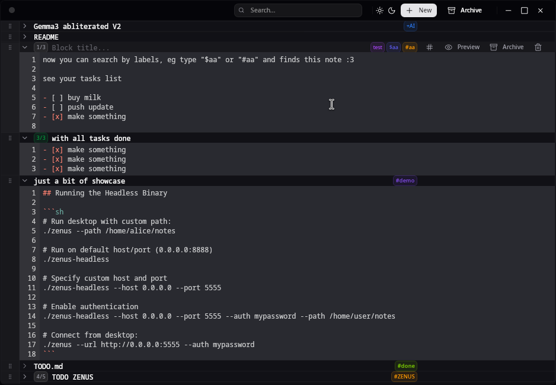

# Zen Notes

A beautiful note-taking app built with Tauri, Preact, and Tailwind CSS. Features markdown preview, customizable block titles, and a clean, modern interface.



## Features

- **Block-based Notes**: Organize your notes in customizable blocks
- **Markdown Preview**: Toggle between edit and preview modes with full markdown support
- **Custom Titles**: Each block can have its own title
- **Modern UI**: Clean, responsive design with dark mode support
- **Archive System**: Keep your workspace clean by archiving old notes
- **Wiki-style Linking**: Connect notes using `[[Note Title]]` syntax
- **Cross-platform**: Built with Tauri for native performance

## Getting Started

### Prerequisites

- [Rust](https://rustup.rs/)
- [Node.js](https://nodejs.org/) or [Bun](https://bun.sh/)

### Installation

1. Clone the repository
2. Install dependencies:
   ```bash
   bun install
   ```

3. Run the development server:
   ```bash
   bun run dev
   ```

4. Run the Tauri app:
   ```bash
   bun run tauri dev
   ```

## Usage Modes

Zenus supports three modes of operation:

### 1. Local Mode (Default)
Runs as a standalone desktop app, saving notes to the local file system (`~/.local/share/zenus` on Linux).
```bash
# Default location
./zenus

# Custom location
./zenus --path /home/user/my-notes
```

### 2. Server Mode (Headless)
Runs as a CLI-only API server without the GUI. Useful for hosting your notes on a server.
```bash
./zenus-headless --host 0.0.0.0 --port 8888 --auth pass123ord --path /server/notes/data
```

### 3. Client Mode (Remote)
Runs the GUI app but connects to a remote Zenus server instead of using local storage.
```bash
./zenus --url http://api.zenus.xyz:8888 --auth pass123ord
```

## Usage

- **Creating Notes**: Click "New Block, Click Me" to add a new note block
- **Editing Titles**: Click on any block title to edit it
- **Markdown Preview**: Click the "Preview" button to see rendered markdown
- **Archiving**: Archive notes to clear clutter, and view them in the Archive tab
- **Linking**: Type `[[Note Title]]` to link to other notes; click to navigate
- **Writing Notes**: Use the textarea to write your notes in markdown format

## Recommended IDE Setup

- [VS Code](https://code.visualstudio.com/) + [Tauri](https://marketplace.visualstudio.com/items?itemName=tauri-apps.tauri-vscode) + [rust-analyzer](https://marketplace.visualstudio.com/items?itemName=rust-lang.rust-analyzer)